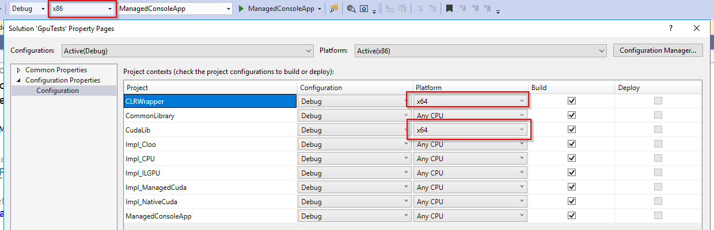
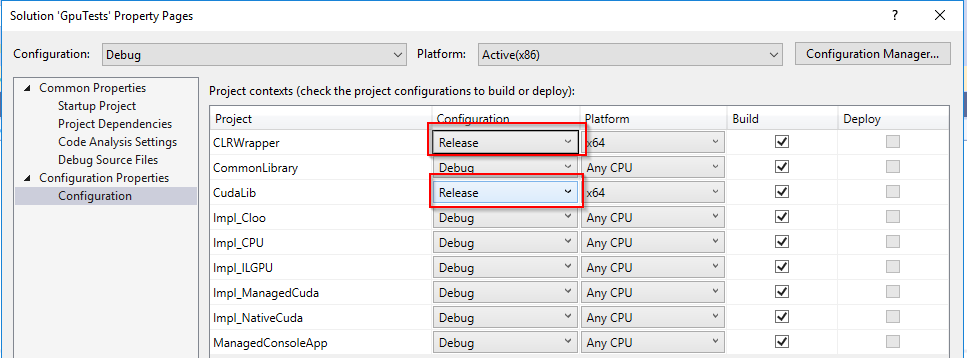
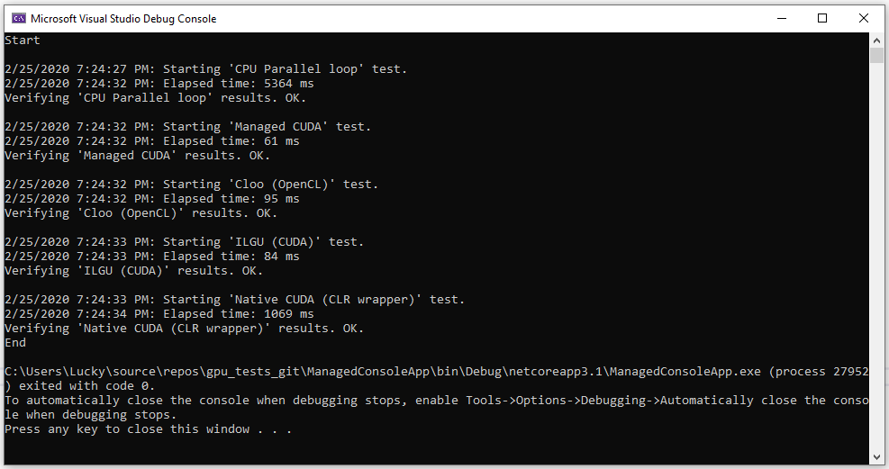

# GPU tests

Testing computations on GPU, using OpenCl, CUDA, in future maybe Vulkan. All of this preferably on .Net Core

## Prerequisites

* Visual studio 2019 w/ C++/CLR component
* .Net Core 3.1
* Cuda 10.2

## Building

Until I learn how to commit build configuration in git, you will have to set following config, in order to things start working out-of-the-box.



Also, CUDA will perform a lot faster, when optimizations are applied, so I also recommend setting the following:



## Performance

Results (25.02.2020) (old):



```diff
- Current issues (25.02.2020):
```

* Native Cuda code launcher is slower than most of the methods, except the CPU. At the same time - ManagedCuda performs very well, despite using the same base as native.. Something wrong with the compiler settings??

Results (28.02.2020). Found the issue. It was the wrong number in grid/block size. After correction everything performs very well.


Also worth mentioning, that writing a wrapper is more complicated than writing the managedCuda code.
Also, writing the managedCuda code is a bit harder than writing IlGPU code.
Also, writing OpenCL will make your code available on Radeon video cards, by sacrificing a tiny little bit of performance..
The choice is hard. 

### Settings:

It is possible to increase number of computation performed by setting the `DataGenerator` properties. For example: `DataGenerator.Height`.
