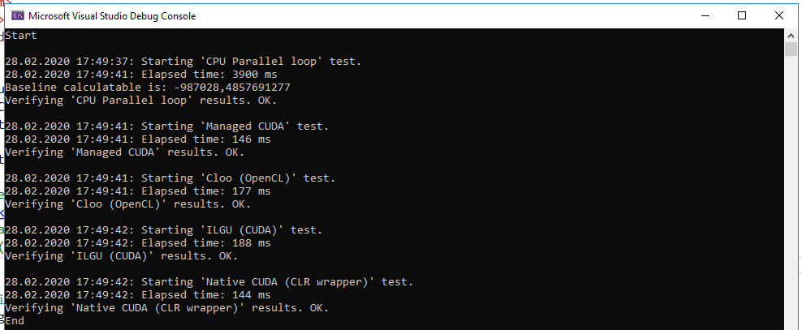
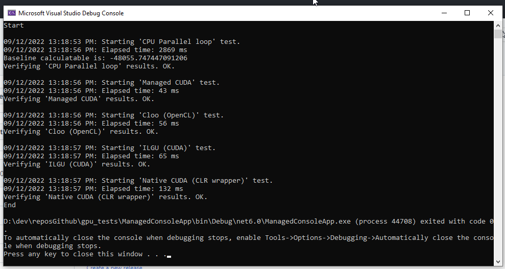

# GPU tests

Testing computations on `GPU`, using `OpenCl`, `CUDA`, in future maybe `Vulkan`. All of this preferably on `.Net 6`

## Prerequisites

* `Visual studio 2022 w/ C++/CLR component`
* `.NET 6`
* `CUDA 11.2`

## Tools used and compared

* Parallel for on CPU (https://learn.microsoft.com/en-us/dotnet/api/system.threading.tasks.parallel.for?view=net-7.0)
* ManagedCUDA (https://github.com/kunzmi/managedCuda) for CUDA
* Cloo (https://github.com/clSharp/Cloo) for OpenCL
* ILGPU (https://github.com/m4rs-mt/ILGPU) also for CUDA
* C++/CLI wrapper (https://learn.microsoft.com/en-us/cpp/dotnet/walkthrough-compiling-a-cpp-program-that-targets-the-clr-in-visual-studio?view=msvc-170)


## OpenCL

For `OpenCL` I used the `CLEditor` to write and test-compile the kernel. You can also use the `OpenCLTemplate`, I think.

## Building

Until I learn how to commit build configuration in `git`, you will have to set following config, in order to things start working out-of-the-box.


Also, CUDA will perform a lot faster, when optimizations are applied, so I also recommend setting the following:


## Performance

### Results (25.02.2020)


```diff
- Current issues (25.02.2020):
```

* Native Cuda code launcher is slower than most of the methods, except the CPU. At the same time - ManagedCuda performs very well, despite using the same base as native.. Something wrong with the compiler settings??

### Results (28.02.2020)

Found the issue. It was the wrong number in grid/block size. After correction everything performs very well.



Worth mentioning

* writing a CLR wrapper is more complicated than writing `managedCuda` code.

* writing `managedCuda` code is a bit harder than writing `ILGPU` code.

* writing `OpenCL` will make your code available on `Radeon` video cards, by sacrificing a tiny little bit of performance..

The choice is hard. 

### Results (09.12.2022)

Following updates were done:

* solution was migrated `VS2019` -> `VS2022`
* `CUDA` 10.2->11.2
* libraries got updated to latest versions (ex. `ILGPU`)
* .net `standard 2.0` -> 2.1
* `.Net Core 3.1` -> `.NET6`

Plus some minor modifications to kernel file.



### Settings

It is possible to increase number of computation performed by setting the `DataGenerator` properties. For example: `DataGenerator.Height`.

## Troubleshooting

### Unable to load the project


If unable to load the project, due to not having the correct `CUDA` version or the `VS` platform toolset version installed you have to adjust the project file settings manually before reloading the project in solution.

i.e. this:

```xml
  <PropertyGroup Condition="'$(Configuration)|$(Platform)'=='Debug|Win32'" Label="Configuration">
    <ConfigurationType>Application</ConfigurationType>
    <UseDebugLibraries>true</UseDebugLibraries>
    <PlatformToolset>v142</PlatformToolset>
    <CharacterSet>Unicode</CharacterSet>
  </PropertyGroup>
  <PropertyGroup Condition="'$(Configuration)|$(Platform)'=='Release|Win32'" Label="Configuration">
    <ConfigurationType>Application</ConfigurationType>
    <UseDebugLibraries>false</UseDebugLibraries>
    <PlatformToolset>v142</PlatformToolset>
    <WholeProgramOptimization>true</WholeProgramOptimization>
    <CharacterSet>Unicode</CharacterSet>
  </PropertyGroup>
  <PropertyGroup Condition="'$(Configuration)|$(Platform)'=='Debug|x64'" Label="Configuration">
    <ConfigurationType>StaticLibrary</ConfigurationType>
    <UseDebugLibraries>true</UseDebugLibraries>
    <PlatformToolset>v142</PlatformToolset>
    <CharacterSet>Unicode</CharacterSet>
  </PropertyGroup>
  <PropertyGroup Condition="'$(Configuration)|$(Platform)'=='Release|x64'" Label="Configuration">
    <ConfigurationType>StaticLibrary</ConfigurationType>
    <UseDebugLibraries>false</UseDebugLibraries>
    <PlatformToolset>v142</PlatformToolset>
    <WholeProgramOptimization>true</WholeProgramOptimization>
    <CharacterSet>Unicode</CharacterSet>
  </PropertyGroup>
  <Import Project="$(VCTargetsPath)\Microsoft.Cpp.props" />
  <ImportGroup Label="ExtensionSettings">
    <Import Project="$(VCTargetsPath)\BuildCustomizations\CUDA 10.2.props" />
  </ImportGroup>
  <ImportGroup Label="ExtensionTargets">
    <Import Project="$(VCTargetsPath)\BuildCustomizations\CUDA 10.2.targets" />
  </ImportGroup>
```

was chaned to:

```xml
  <PropertyGroup Condition="'$(Configuration)|$(Platform)'=='Debug|Win32'" Label="Configuration">
    <ConfigurationType>Application</ConfigurationType>
    <UseDebugLibraries>true</UseDebugLibraries>
    <PlatformToolset>v142</PlatformToolset>
    <CharacterSet>Unicode</CharacterSet>
  </PropertyGroup>
  <PropertyGroup Condition="'$(Configuration)|$(Platform)'=='Release|Win32'" Label="Configuration">
    <ConfigurationType>Application</ConfigurationType>
    <UseDebugLibraries>false</UseDebugLibraries>
    <PlatformToolset>v142</PlatformToolset>
    <WholeProgramOptimization>true</WholeProgramOptimization>
    <CharacterSet>Unicode</CharacterSet>
  </PropertyGroup>
  <PropertyGroup Condition="'$(Configuration)|$(Platform)'=='Debug|x64'" Label="Configuration">
    <ConfigurationType>StaticLibrary</ConfigurationType>
    <UseDebugLibraries>true</UseDebugLibraries>
    <PlatformToolset>v142</PlatformToolset>
    <CharacterSet>Unicode</CharacterSet>
  </PropertyGroup>
  <PropertyGroup Condition="'$(Configuration)|$(Platform)'=='Release|x64'" Label="Configuration">
    <ConfigurationType>StaticLibrary</ConfigurationType>
    <UseDebugLibraries>false</UseDebugLibraries>
    <PlatformToolset>v142</PlatformToolset>
    <WholeProgramOptimization>true</WholeProgramOptimization>
    <CharacterSet>Unicode</CharacterSet>
  </PropertyGroup>
  <Import Project="$(VCTargetsPath)\Microsoft.Cpp.props" />
  <ImportGroup Label="ExtensionSettings">
    <Import Project="$(VCTargetsPath)\BuildCustomizations\CUDA 11.2.props" />
  </ImportGroup>
  <ImportGroup Label="ExtensionTargets">
    <Import Project="$(VCTargetsPath)\BuildCustomizations\CUDA 11.2.targets" />
  </ImportGroup>
```

Also make sure that the cuda props exist relevant directory, i.e.

Files

* CUDA 11.2.props
* CUDA 11.2.targets
* CUDA 11.2.xml
* Nvda.Build.CudaTasks.v11.2.dll

Are present here

`C:\Program Files (x86)\Microsoft Visual Studio\2019\BuildTools\MSBuild\Microsoft\VC\v160\BuildCustomizations`

You can copy them from CUDA installation directory

`C:\Program Files\NVIDIA GPU Computing Toolkit\CUDA\v11.2\extras\visual_studio_integration\MSBuildExtensions`

Adjust the path/actions according to your setup.


